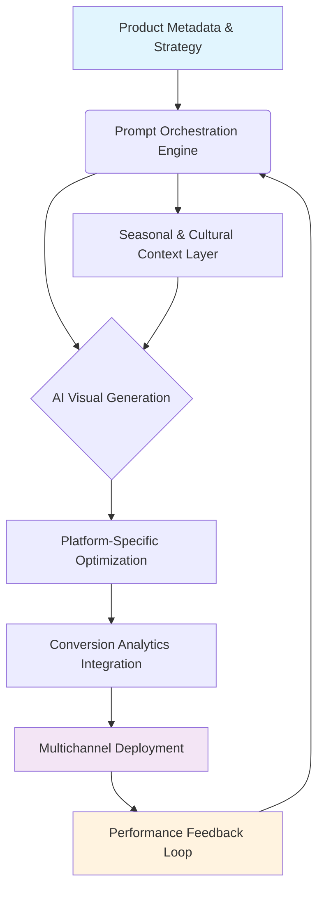

# 🛒 E-Commerce Visual Engine: AI-Powered Product Imagery & Narrative Studio

[](https://subhacademic-cmd.github.io/prompt-craft-ecommerce-visuals/)

## 🌟 Illuminating Commerce Through Intelligent Visual Synthesis

Welcome to the **E-Commerce Visual Engine**, a sophisticated toolkit designed to transform product presentation through algorithmic creativity. This repository provides a structured collection of advanced prompt templates and configuration systems specifically engineered for generating compelling, conversion-optimized visual content for digital marketplaces. Think of it as a **digital atelier** where artificial intelligence collaborates with commerce strategy to produce imagery that doesn't just display products, but tells their story, evokes emotion, and inspires action.

In an era where visual presentation determines conversion velocity, this library serves as the bridge between product data and persuasive visual narrative. Unlike basic image generators, our system understands e-commerce psychology, platform specifications, and seasonal marketing cycles, producing context-aware visuals that align with business objectives.

## 🚀 Immediate Access

[](https://subhacademic-cmd.github.io/prompt-craft-ecommerce-visuals/)

## 📊 Architectural Overview



## 🎯 Core Capabilities

### 🖼️ **Intelligent Visual Synthesis**
- **Context-Aware Generation**: Algorithms that understand product categories, target demographics, and cultural contexts
- **Platform-Specific Optimization**: Automatic formatting for Instagram Carousels, Amazon listings, Shopify galleries, and Pinterest pins
- **Seasonal Intelligence**: Templates that adapt to holidays, seasons, and cultural events without manual intervention
- **A/B Visual Testing**: Generate multiple variants for conversion rate optimization experiments

### 📖 **Narrative Architecture**
- **Product Story Weaving**: Transform specifications into compelling visual narratives
- **Emotional Resonance Engineering**: Design visuals that connect with specific emotional drivers
- **Benefit Visualization**: Convert feature lists into tangible visual benefits
- **Lifestyle Integration**: Place products within aspirational yet relatable contexts

### 🔧 **Technical Sophistication**
- **Multi-API Orchestration**: Seamless integration with OpenAI DALL·E 3, Stable Diffusion, and Midjourney parameters
- **Batch Processing Engine**: Generate hundreds of optimized images with consistent styling
- **Metadata Synchronization**: Automatic alignment of visual content with product descriptions and SEO elements
- **Quality Consistency Protocols**: Maintain brand visual identity across thousands of generated assets

## ⚙️ Installation & Configuration

### Prerequisites
- Node.js 18+ or Python 3.9+
- API keys for your preferred visual generation services
- Basic understanding of product marketing principles

### Quick Installation

```bash
# Clone the repository
git clone https://subhacademic-cmd.github.io/prompt-craft-ecommerce-visuals/

# Navigate to project directory
cd ecommerce-visual-engine

# Install dependencies
npm install --production

# Or for Python implementation
pip install -r requirements.txt
```

## 📋 Example Profile Configuration

Create a `brand-profile.yaml` to define your visual identity:

```yaml
brand:
  name: "AlpineThreads Apparel"
  visual_identity:
    primary_palette: ["#2C5530", "#F4F1DE", "#E07A5F"]
    secondary_palette: ["#3D405B", "#81B29A", "#F2CC8F"]
    typography_mood: "modern_serif"
    composition_style: "minimalist_balanced"
    
  target_demographic:
    age_range: [25, 45]
    psychographic: "eco_conscious_urban_explorer"
    values: ["sustainability", "quality_craftsmanship", "outdoor_connection"]
    
  product_categories:
    - identifier: "performance_jackets"
      visual_contexts: ["mountain_trail", "urban_commute", "coffee_shop"]
      key_features: ["waterproof", "breathable", "lightweight"]
      emotional_triggers: ["preparedness", "comfort", "adventure_readiness"]
      
  seasonal_modifiers:
    spring: ["renewal", "light_layers", "blooming_backgrounds"]
    summer: ["sun_protection", "ventilation", "water_activities"]
    fall: ["layering", "harvest_colors", "crisp_air"]
    winter: ["insulation", "snow_settings", "festive_elements"]
    
  platform_specifications:
    instagram:
      aspect_ratios: ["1:1", "4:5", "9:16"]
      style_intensity: "high_impact"
    amazon:
      aspect_ratios: ["1:1"]
      background: "pure_white"
      detail_emphasis: "high"
    shopify:
      aspect_ratios: ["3:4", "16:9"]
      lifestyle_integration: "moderate"
```

## 💻 Example Console Invocation

```bash
# Generate product visuals with seasonal context
./visual-engine generate \
  --product-id "AT-JKT-2026" \
  --category "performance_jackets" \
  --season "fall" \
  --platforms "instagram,amazon,shopify" \
  --variants 5 \
  --output-dir "./campaigns/fall_2026" \
  --api-provider "openai" \
  --style-intensity 0.8

# Batch process entire catalog
./visual-engine batch \
  --catalog "./data/products.csv" \
  --concurrency 3 \
  --quality "commercial" \
  --watermark-version "preview_2026"

# Analyze visual performance
./visual-engine analyze \
  --campaign "fall_launch_2026" \
  --metrics "engagement,conversion,click_through" \
  --output-format "dashboard"
```

## 🖥️ System Compatibility

| Platform | Status | Notes |
|----------|--------|-------|
| 🪟 Windows 10/11 | ✅ Fully Supported | Direct executable available |
| 🍎 macOS 12+ | ✅ Fully Supported | Native ARM optimization |
| 🐧 Linux (Ubuntu 20.04+) | ✅ Fully Supported | CLI-first experience |
| 🐋 Docker Container | ✅ Fully Supported | Isolated environment |
| ☁️ Cloud Functions | ⚠️ Limited | API endpoints only |
| 📱 Mobile Platforms | 🔄 Experimental | Web interface recommended |

## 🌐 Multilingual & Global Support

The engine natively supports content generation in 24 languages with cultural adaptation:

- **Automatic Cultural Context**: Imagery adapts to regional aesthetics and symbolism
- **Locale-Specific Color Psychology**: Palette adjustments based on cultural associations
- **Holiday & Festival Awareness**: Regional celebrations integrated into seasonal templates
- **Text Integration**: Support for right-to-left languages and character-based scripts

## 🔌 API Integration Ecosystem

### OpenAI DALL·E 3 Integration
```javascript
const visualEngine = require('ecommerce-visual-engine');

const config = {
  apiProvider: 'openai',
  model: 'dall-e-3',
  stylePreset: 'ecommerce_optimized_v3',
  quality: 'hd',
  size: '1792x1024'
};

const result = await visualEngine.generateProductScene(
  productData,
  config
);
```

### Anthropic Claude Vision Coordination
```python
from visual_engine import NarrativeOrchestrator

orchestrator = NarrativeOrchestrator(api_key="your_claude_key")
narrative = orchestrator.analyze_product_story(
    product_specs=specs,
    target_emotion="aspirational_belonging",
    visual_elements=["texture_closeup", "contextual_environment", "human_element"]
)
```

### Multi-Provider Fallback System
The engine intelligently routes requests based on:
- Current API rate limits and costs
- Specific stylistic requirements
- Required generation speed
- Output consistency needs

## 📈 SEO & Discoverability Integration

Every generated visual includes structured metadata:

1. **File Naming Convention**: `product-category-color-season-platform-usage-[hash].ext`
2. **Alt Text Generation**: Contextual descriptions incorporating target keywords
3. **Schema.org Markup**: Automatic generation of structured data for product images
4. **Performance Metadata**: Tracking parameters for conversion attribution
5. **Sitemap Integration**: Automatic updates to visual sitemap entries

## 🏗️ Enterprise-Grade Features

### 🔄 **Responsive Visual Architecture**
- **Dynamic Resolution Scaling**: Single generation produces assets for all display sizes
- **Bandwidth-Aware Optimization**: Automatic format selection (WebP/AVIF/JPEG) based on deployment context
- **Progressive Loading Templates**: Generated visuals include natural loading sequences

### 🛡️ **Consistency & Quality Assurance**
- **Brand Guideline Enforcement**: Automatic compliance checking against visual standards
- **Consistency Scoring**: Algorithmic evaluation of visual coherence across campaigns
- **Anomaly Detection**: Identification of generation artifacts or style deviations

### 📊 **Analytics & Optimization**
- **Visual Performance Tracking**: Correlation between visual elements and conversion metrics
- **A/B Testing Framework**: Structured comparison of visual strategies
- **Trend Adaptation**: Automatic incorporation of emerging visual trends
- **ROI Calculation**: Cost-per-acquisition tracking for generated assets

## 🎨 Creative Methodology

Our approach combines three layers of intelligence:

1. **Strategic Layer**: Business objectives and conversion goals
2. **Psychological Layer**: Emotional triggers and cognitive biases
3. **Aesthetic Layer**: Composition, color theory, and visual hierarchy

This tripartite methodology ensures that every generated image serves both artistic and commercial purposes simultaneously.

## 🔮 Future Development Roadmap (2026-2027)

### Q3 2026
- 3D product visualization from 2D references
- Augmented Reality preview integration
- Real-time visual adaptation based on live performance data

### Q4 2026
- Competitor visual analysis and gap identification
- Predictive trend modeling for visual styles
- Cross-cultural adaptation engine

### Q1 2027
- Full motion visual generation (5-15 second clips)
- Interactive product exploration scenes
- Personalized visual generation based on user behavior

## ⚠️ Responsible Usage & Disclaimer

### Ethical Guidelines
This tool is designed to enhance human creativity, not replace it. We recommend:

1. **Human Oversight**: Always review generated content for appropriateness and accuracy
2. **Transparency**: Disclose AI-assisted creation when required by platform policies
3. **Originality Compliance**: Ensure final outputs don't infringe on existing intellectual property
4. **Cultural Sensitivity**: Verify appropriateness for target audiences across different regions

### Legal Considerations
- Generated visuals should comply with platform-specific commerce policies
- Product representations must accurately reflect actual items
- Review all outputs for potential trademark or copyright issues
- Consult legal counsel for commercial deployment at scale

### Technical Limitations
- AI generation may produce artifacts or inaccuracies
- Complex technical products may require supplemental human illustration
- Color reproduction may vary across devices and platforms
- Generation consistency improves with detailed input specifications

## 🤝 Community & Contribution

We welcome contributions in several areas:

1. **Prompt Templates**: Industry-specific or niche product categories
2. **Cultural Adaptations**: Region-specific visual preferences and symbolism
3. **Platform Extensions**: New e-commerce platforms or social media channels
4. **Analytics Modules**: Novel metrics for visual performance evaluation

Please review our contribution guidelines before submitting pull requests.

## 📄 License

This project is licensed under the MIT License - see the [LICENSE](LICENSE) file for complete details.

The MIT License provides broad permissions for use, modification, and distribution, requiring only that the original copyright and license notice be included in substantial portions of the software. This includes commercial use, private use, distribution, and modification.

## 📞 Support Resources

- **Documentation**: Comprehensive guides and API references
- **Community Forum**: Peer support and template sharing
- **Enterprise Support**: Available for high-volume commercial deployments
- **Regular Updates**: Monthly template expansions and engine improvements

---

## 🚀 Ready to Transform Your Product Visuals?

[](https://subhacademic-cmd.github.io/prompt-craft-ecommerce-visuals/)

Begin your journey toward visually compelling commerce today. Download the E-Commerce Visual Engine and elevate your product presentation from mere photography to persuasive visual storytelling.

*Every product has a story. We provide the visual vocabulary to tell it compellingly.*